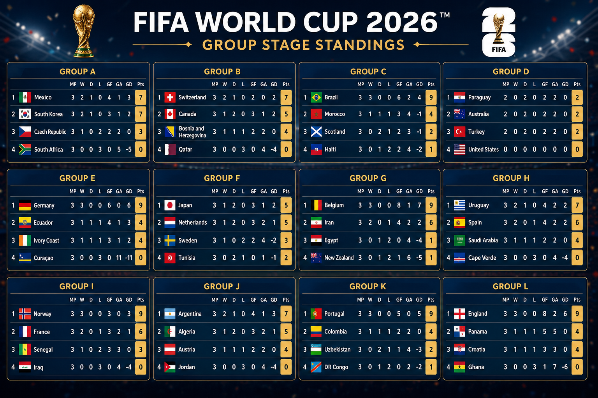

# FIFA World Cup 2026 — Group Stage Predictions

This repository contains a Jupyter notebook that predicts group-stage standings for the FIFA World Cup 2026 using historical FIFA rankings and past match results. The notebook performs data loading, exploratory data analysis (EDA), feature engineering, and applies machine learning models to forecast group standings.

**Project Overview**
- **Notebook:** [group-stage-world-cup-2026-predictions.ipynb](group-stage-world-cup-2026-predictions.ipynb) — end-to-end analysis and predictions.
- **Purpose:** Use ranking and historical results to predict group-stage finishing positions and points.

**Input data**
- **Data folder:** `data/`
- **Files included:**
  - [data/fifa_ranking-2023-07-20.csv](data/fifa_ranking-2023-07-20.csv)
  - [data/fifa_ranking-2024-04-04.csv](data/fifa_ranking-2024-04-04.csv)
  - [data/fifa_ranking-2024-06-20.csv](data/fifa_ranking-2024-06-20.csv)
  - [data/results.csv](data/results.csv)

**Exploratory Data Analysis (EDA)**
- **Load & preview:** Read CSVs into pandas and inspect missing values and basic statistics.
- **Time alignment:** Align ranking snapshots to match the dates of interest for the tournament window.

**Feature engineering**
- **Ranking features:** Latest FIFA ranking, ranking difference between opponents, ranking percentiles.
- **Form features:** Recent win/draw/loss counts, goals for/against in last N matches.

**Modeling & methods**
- **Problem framing:** Predict the correct score for each group stage match.
- **Algorithms tried:** Typical approaches include logistic regression for pairwise match outcomes, gradient-boosted trees (e.g., XGBoost or LightGBM) for number of goals to score for each team, and simple ensemble averaging for robustness.
- **Evaluation:** Use cross-validation and ranking-aware metrics (MAE for points, accuracy for exact score prediction, and accuracy for predicting W/D/L outcomes)
- **Prediction pipeline:**
 → Prepare match-up dataset  
 → Compute features  
 → Temporal train / val / test split  
 → Train & select best model on train/val  
 → Retrain on train+val, evaluate on test  
 → Calibrate probabilities  
 → Simulate group matches (N times)  
 → Aggregate predicted points  
 → Derive final standings

**Results**
- The notebook outputs the predicted group stage standings — the final result of the simulation.

**Notes & next steps**
- Evaluate the model against real results at the end of the 2026 World Cup group stage.
- Based on that evaluation, build a refined approach to predict knockout matches and forecast the winner of the 2026 World Cup.

---
